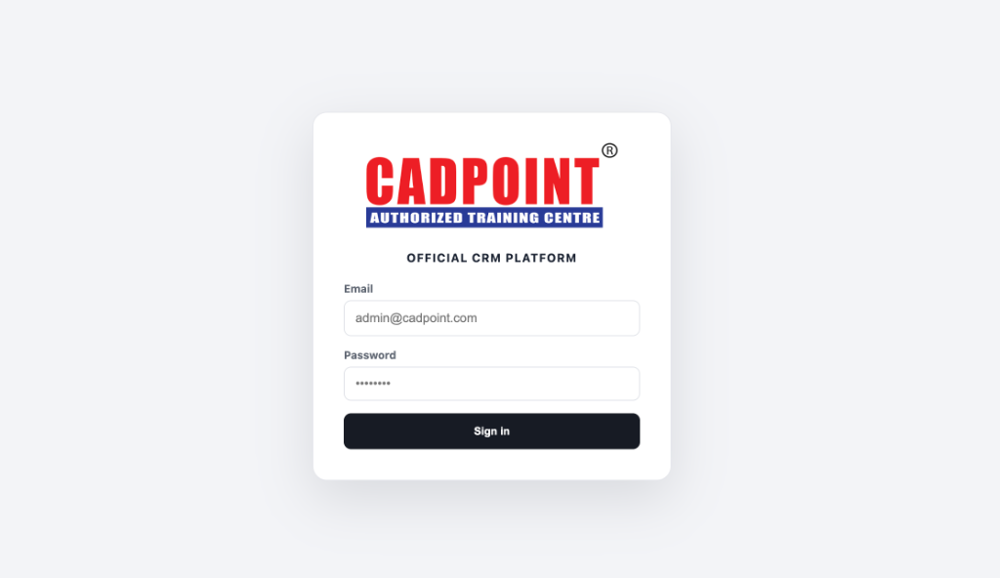
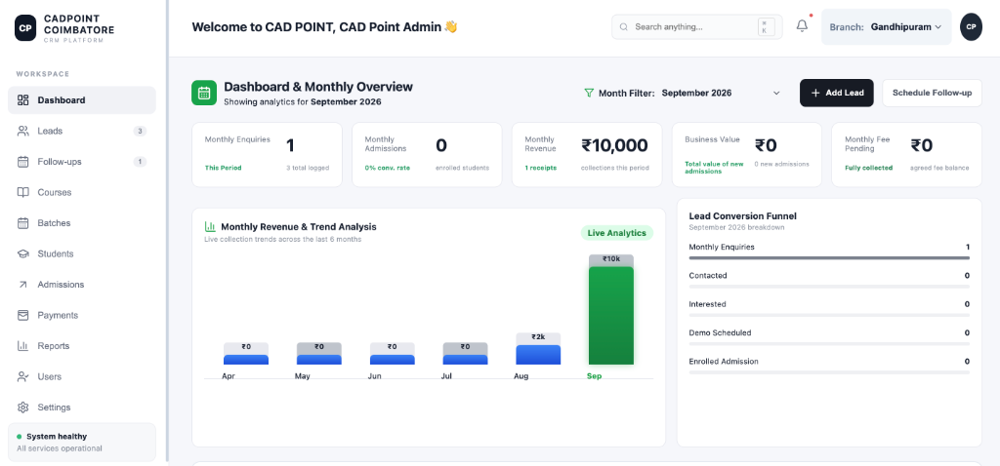
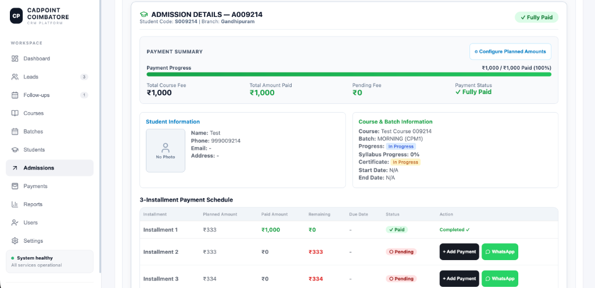
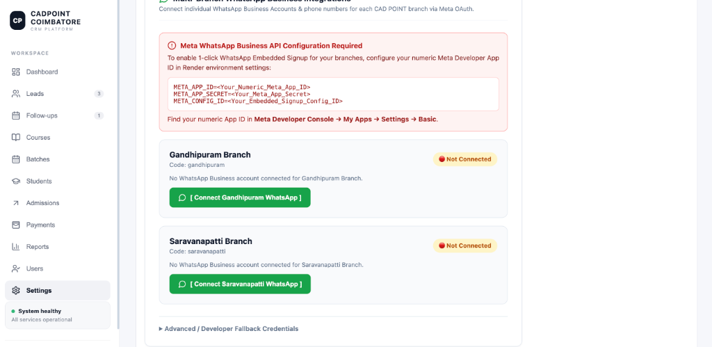
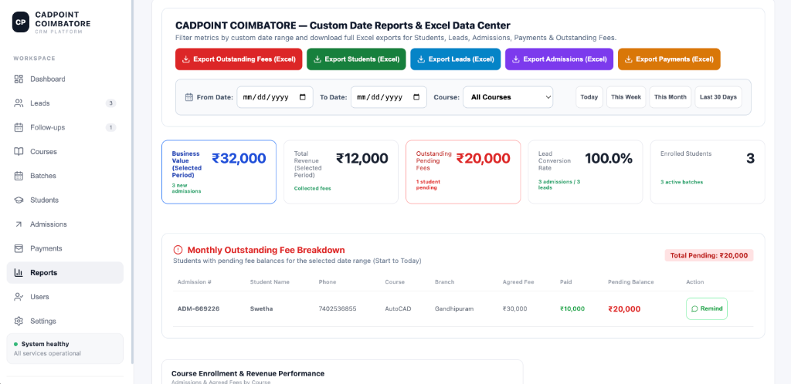

# CAD Points CRM

> **Full-Stack Customer Relationship & Business Management Platform**


---

> 🔒 **Source Code Notice:** This repository is kept **PRIVATE** because the project was developed for a commercial/client use case. The repository contains proprietary implementation details, internal workflow logic, and business configurations, therefore the source code is not publicly available. A project walkthrough and live demonstration can be provided upon request.

---

## 📌 Project Overview

**CAD Points CRM** is a production-oriented Customer Relationship Management and enterprise operations platform designed specifically for vocational training and educational institutes. The system streamlines end-to-end customer lifecycles—from initial lead acquisition and scheduled follow-ups to student admissions, course batch allocations, fee collection, multi-branch reporting, Meta WhatsApp API configuration, and hardware device registration.

Built with a modern decoupled full-stack architecture, the CRM delivers a high-performance desktop experience alongside an optimized mobile application UI for staff on the go.

---

## ✨ Key Features

* **Customer & Student Management**: Centralized profiles, student code generation, course enrollments, and academic batch progress tracking.
* **Lead Pipeline & Prospect Tracking**: Multi-channel lead capture, lead disposition status tracking, and 1-tap conversion to active student admissions.
* **Follow-up & Reminder System**: Automated follow-up calendar, scheduled call/meeting reminders, and direct 1-tap WhatsApp messaging integration.
* **Admission & Installment Management**: Final fee agreement tracking, 3-installment payment schedules, pending balance computation, and automated fee receipts.
* **Business Reports & Analytics**: Real-time revenue analytics, branch performance comparison, enrollment metrics, custom date range filtering, and instant 1-tap Excel data exports.
* **Role-Based Access Control (RBAC)**: Fine-grained permission matrix tailored for `Super Admin`, `Admin`, `Counsellor`, `Trainer`, `Accountant`, `Accounts`, and `Receptionist` roles.
* **Multi-Branch WhatsApp Business Integration**: Dedicated WhatsApp Business API configuration per branch with Meta OAuth signup integration.
* **Multi-Branch Management**: Multi-location support (Gandhipuram, Saravanapatti, All Branches) with isolated branch datasets and unified administrative controls.
* **Device Security & Registration**: Authorized device registration system restricting CRM access to validated hardware devices binding to central PostgreSQL database.
* **Excel Data Center**: High-performance client-side Excel report generation for admissions, fee collections, student registries, and lead analytics.
* **Authentication & Security**: Secure JSON Web Token (JWT) authorization, salted bcrypt password hashing, and Zod input schema validation.
* **Responsive Mobile Experience**: Native-feeling mobile app interface with quick action sheets, bottom navigation bar, and PWA (Progressive Web App) manifest support.

---

## 🛠️ Technology Stack

| Layer | Technologies & Tools Used |
| :--- | :--- |
| **Frontend UI / UX** | React 18, Vite 5, Lucide React Icons, Custom CSS3 / Responsive Layouts, HTML5 PWA Manifest |
| **Backend & API Layer** | Node.js, Express.js REST API, Prisma ORM, Zod Schema Validation, Bcrypt.js, JSON Web Tokens (JWT) |
| **Database & Security** | PostgreSQL (Supabase Managed), Multi-Branch Data Schema, Salted Hashing, Hardware Device Binding |
| **Testing & CI/CD** | Vitest Test Runner, GitHub Actions CI, Vercel (Frontend Deployment), Render (Backend API Deployment) |

---

## 📸 UI Showcase & Screenshots

### 🔑 Authentication & Login Page
*Official CADPOINT branded login portal with secure authentication.*



---

### 📊 Executive Dashboard & Analytics
*Comprehensive real-time overview of monthly enquiries, admissions, collection revenue, and 6-month trend analysis.*



---

### 🎓 Admissions & 3-Installment Payment Schedule
*Detailed student enrollment record, payment progress bar, course info, and 3-installment payment schedule.*


---

### 📈 Reports & Excel Data Center
*Custom date range filtering, outstanding fee breakdown, and 1-tap Excel exports for students, leads, admissions, and payments.*



---

### 💬 Multi-Branch WhatsApp Business Integration
*Individual Meta WhatsApp Business Account setup per branch with 1-click signup integration.*



---

### 🔒 Device Security & Authorized Devices
*Authorized hardware device management restricting CRM access to central authoritative PostgreSQL database.*



---

### 👥 User Control & Role Management
*Fine-grained role assignment and user access configuration for administrative controls.*


---

### 📱 Mobile UI Experience
*Touch-optimized quick actions, floating navigation, and mobile drawer sheets.*


---

## 🏗️ Architecture Overview

The platform uses a decoupled client-server architecture designed for reliability, responsiveness, and secure data isolation:

```
┌────────────────────────────────────────────────────────┐
│               CAD Points CRM Frontend                  │
│       React 18 + Vite + PWA Mobile Optimization        │
└───────────────────────────┬────────────────────────────┘
                            │  HTTPS REST API (JWT)
                            ▼
┌────────────────────────────────────────────────────────┐
│                 Node.js / Express API                  │
│      Auth Middleware + Zod Validation + RBAC Rules     │
└───────────────────────────┬────────────────────────────┘
                            │  Prisma ORM
                            ▼
┌────────────────────────────────────────────────────────┐
│               PostgreSQL Database                      │
│        Multi-Branch Tables + Device Registry           │
└───────────────────────────┴────────────────────────────┘
```

---

## 👨‍💻 My Contribution

As the **Primary Full-Stack Developer**, I engineered and delivered this CRM platform from concept to production:

* Designed and built the responsive frontend single-page application using React 18 and Vite.
* Developed the RESTful backend API using Node.js, Express.js, and Prisma ORM.
* Implemented the Role-Based Access Control (RBAC) matrix for 7 distinct user roles.
* Designed the database schema, device binding, and branch isolation logic in PostgreSQL.
* Built the mobile-optimized UI architecture and Progressive Web App (PWA) configuration.
* Integrated Excel report generation, Meta WhatsApp Business API integration, and 1-tap communication links.
* Implemented the hardware device registration system for security compliance.
* Set up automated testing pipelines and deployed the production application on Vercel and Render.

---

## 🧪 Testing & Quality Assurance

The application underwent rigorous quality verification across multiple dimensions:

* **Automated Unit Testing**: Vitest test suites verifying core client and server modules.
* **RBAC Security Audits**: Verification of endpoint authorization across all 7 user roles.
* **Mobile Breakpoint Verification**: Responsive layout testing across 375px (iPhone), 412px (Android), 768px (iPad), and 1024px+ (Desktop).
* **Data Validation & Error Guarding**: Defensive null guards and Zod schema parsing on incoming payloads.

---

## 🚀 Deployment & Demo Status

* **Frontend Hosting**: Vercel (Continuous Deployment from `main`)
* **Backend API Hosting**: Render (Node.js Environment)
* **Database**: Managed PostgreSQL on Supabase
* **Live Demo**: **Available upon request**

---

## 📩 Contact & Inquiries

For project walkthroughs, live demonstrations, or professional inquiries, please reach out via GitHub or official contact channels.

*Developed with focus on performance, usability, and business efficiency.*
